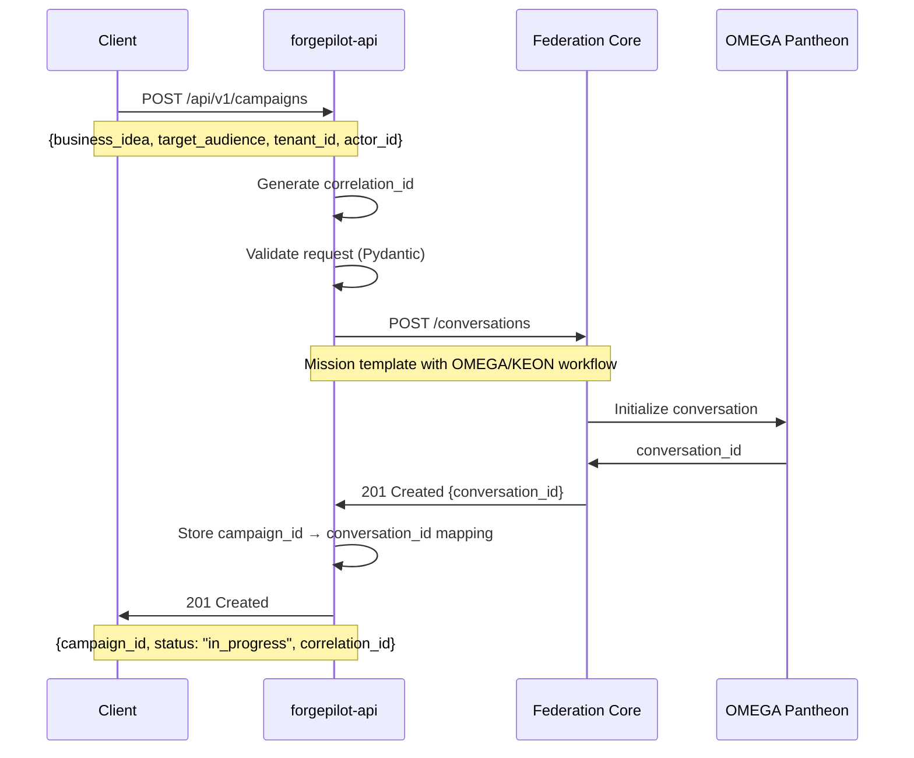
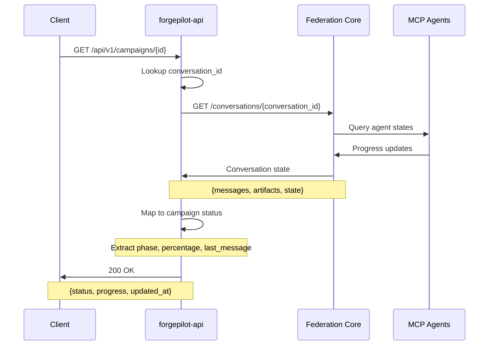
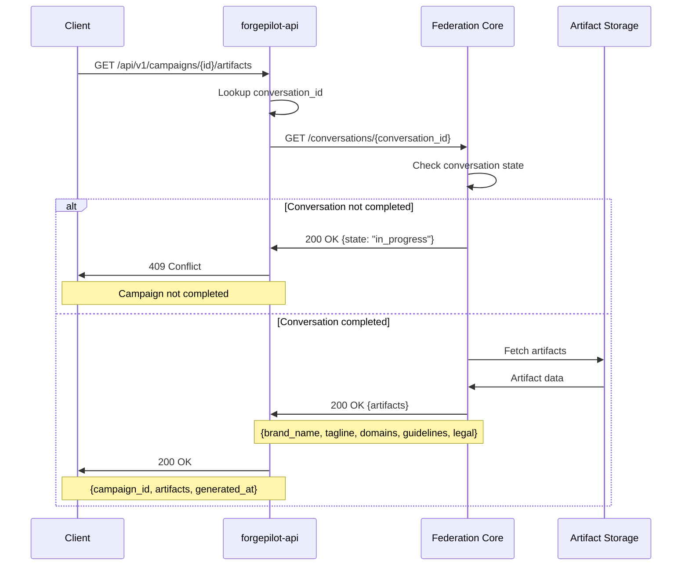
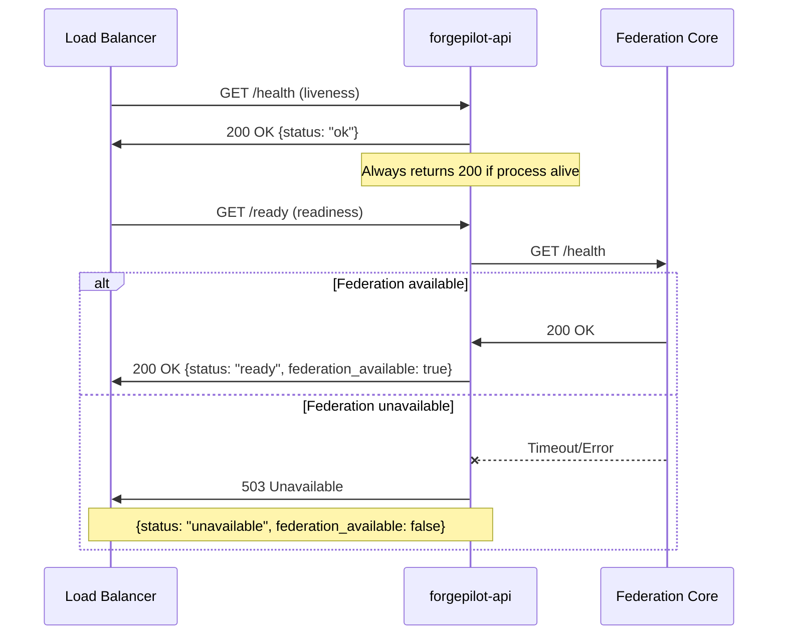
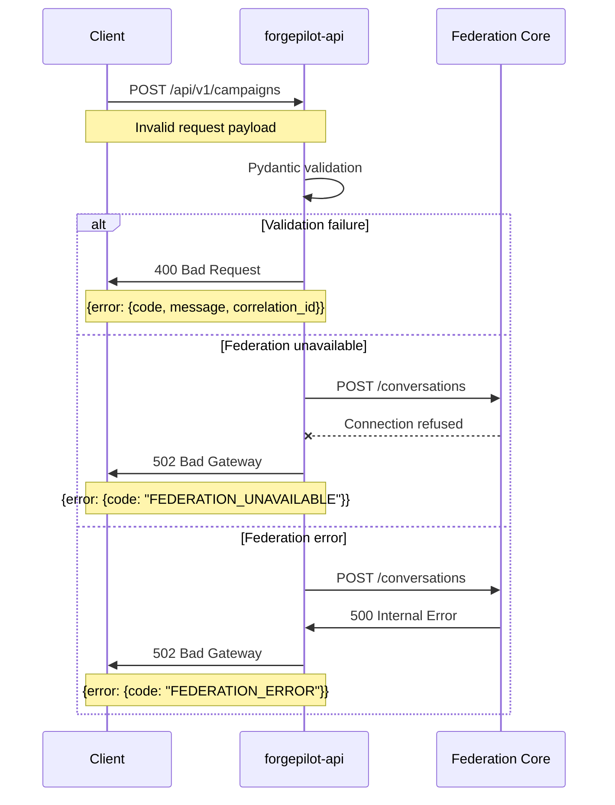

# ForgePilot Backend Sequence Diagrams

## 1. Create Campaign Flow



## 2. Stream Progress Flow



## 3. Fetch Artifacts Flow



## 4. Health Check Flow



## 5. Error Handling Flow



## Key Patterns

### Correlation ID Flow
- Generated by API if not provided
- Propagated to Federation Core
- Returned in all responses
- Used for distributed tracing

### State Mapping
```
Federation State → Campaign Status
----------------------------------
queued         → queued
active         → in_progress
completed      → completed
failed         → failed
```

### Error Codes
- `VALIDATION_ERROR` - Request validation failed
- `CAMPAIGN_NOT_FOUND` - Campaign ID not found
- `CAMPAIGN_NOT_COMPLETED` - Artifacts requested before completion
- `FEDERATION_UNAVAILABLE` - Cannot reach Federation Core
- `FEDERATION_ERROR` - Federation Core returned error
- `INTERNAL_ERROR` - Unexpected API error

## Architecture Principles

1. **Thin Translation Layer**: API only translates HTTP ↔ Federation protocol
2. **No State Management**: Campaign state lives in Federation Core
3. **Fail Fast**: Return 503 immediately if Federation unavailable
4. **Correlation Tracking**: Every request gets correlation_id
5. **Structured Errors**: Consistent error format across all endpoints
