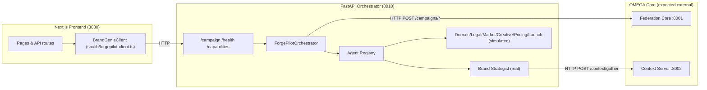

# ForgePilot Architecture Map

## Call Graph (who calls who)
- Frontend `BrandGenieClient` → Backend `/campaign` (HTTP POST JSON) and `/health`/`/capabilities` (HTTP GET).
- FastAPI service → `ForgePilotOrchestrator.create_brand_campaign` → `_execute_*` methods → agent registry entries.
- Orchestrator (when `is_omega_available()` true) → OMEGA Federation Core via HTTP POST `/campaigns/register` and `/campaigns/complete`.
- Brand Strategist Agent (when `is_omega_available()` true) → OMEGA Context Server via HTTP POST `/context/gather`; registers task completion via `/tasks/complete` to Federation Core.

## Notes
- Only Brand Strategist agent is implemented; others are simulated fallbacks.
- OMEGA availability detection relies on importing `core.*` modules; current tree lacks `core`, so integration currently runs in fallback/failed mode.
